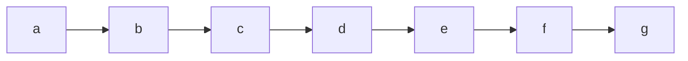
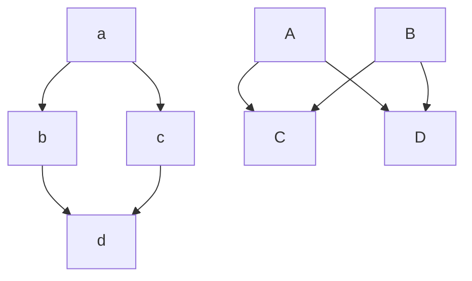

<h1  style="text-align:center;font-size:40px;"><a href="https://gitee.com/mealy_moore/reference/blob/master">markdown语法</a></h1>

[Toc]

## 一、目录
1. 文件头加上 `[Toc]`，有些网站可能不支持 
   各软件用法差异和效果：

   - VSCode ：用 `Markdown Preview Enhanced` （MPE）编写 Markdown，支持通过 `[TOC]` 语法将目录插入到文档的任何位置，同时还会在侧边栏显示相同目录，便于预览时选择跳转。需要注意的是：这种方式创建的 TOC 目录只会在预览中显示，或在浏览器或生成 PDF 等文档浏览，不会修改你的 markdown 文件。并且可以点击预览窗口中的侧边栏目录列表图标，打开侧边栏目录。
   - Typora：支持

   各网站的用法差异和效果：

   - **博客园** 网站编辑界面上，要求 `[TOC]` 必须独占一行。和 VSCode 的 MPE 插件功能类似
   - **CSDN** 的博客编辑界面中，录入 `[TOC]` 时，会将 `[TOC]` 自动转换成 `@[TOC]`。另外，可以在 `@[TOC]` 后面增加目录名称，如：`@[TOC](目录名称)`，但这个后面增加目录名称的语法扩展在 VSCode 的 MPE 插件不支持。
   - **开源中国 OSChina** 网站，在 Markdown 博客撰写界面上没有 `[TOC]` 自动生成目录功能。
   - github 、gitee、gitbook也不支持 。

2. 使用vscode插件`Markdown Preview Enhanced`：简单的 `[TOC]` 目录只能自动显示 Markdown 的 1-6 级目录，不能限定从第 2 级或者第 3 级开始，更不能调整目录的格式等，功能有较大限制。在 MPE 插件支持通过文档头部编写 front-matter ，对[TOC]语法所自动展示的目录进行设置，例如，在文件头增加如下这段 front-matter 代码

   ```markdown
   <!-- @import "[TOC]" {cmd="toc" depthFrom=2 depthTo=3 orderedList=false} -->
   ```

   命令行中各参数说明：
   
   - orderedList 是否使用有序列表
   - depthFrom [1~6] 开始目录层级
   - depthTo [1~6] 明细目录层级
   - ignoreLink 如果设置为 true，那么 TOC 将不会被超链接。
   
   在**确认 MPE 预览窗口打开的状态下**，点击保存或按 `ctrl` + `S`, MPE 将根据参数设定，自动生成目录并插入到光标所在位置。生成代码如下所示：
    ```markdown
    <!-- code_chunk_output -->
    - [一、目录](#一-目录)
    - [二、标题](#二-标题)
    - [三、特殊字符](#三-特殊字符)
      - [1. 换行](#1-换行)
      - [2. 强调](#2-强调)
      - [3. 分割线](#3-分割线)
      - [4. 脚注](#4-脚注)
    - [四、区块](#四-区块)
      - [1. 列表](#1-列表)
      - [2. 区块](#2-区块)
      - [3. 代码段](#3-代码段)
    - [五、链接](#五-链接)
      - [1. url跳转](#1-url跳转)
      - [2. 图片](#2-图片)
      - [3. 页内跳转](#3-页内跳转)
    - [六、表格](#六-表格)
    - [七、文字属性和格式](#七-文字属性和格式)
    <!-- /code_chunk_output -->
    ```
   
   > 注意：如果文档结构 ( 各级标题 ) 将不再变化，可以手工清除目录生成所需代码 ( 将 Markdown 粘贴到不同网站时，有些网站会错误的显示出这些代码，导致结果不符合我们的预期，因此在最终版删除掉这些源代码是最安全的做法 ) 。
   
3. 使用vscode插件`Markdown All in One`可以通过命令`Markdown All in One: Create Table of Contents`插入目录。

## 二、标题
**用法：** n个# + space = n级标题，代码如下：

```markdown
###### 六级标题
##### 五级标题
#### 四级标题
### 三级标题
## 二级标题
# 一级标题
```

效果如下：


## 三、特殊字符
### 1. 换行
**用法**：末尾两空格+回车

 一个 markdown 段落是由一个或多个连续的文本行组成，它的前后要有一个以上的空行（空行的定义是显示上看起来像是空的，便会被视为空行。比方说，若某一行只包含空格和制表符，则该行也会被视为空行）。普通段落不该用空格或制表符来缩进。

「由一个或多个连续的文本行组成」这句话其实暗示了 markdown 允许段落内的强迫换行（插入换行符），这个特性和其他大部分的 text-to-HTML 格式不一样（包括 Movable Type 的「Convert Line Breaks」选项），其它的格式会把每个换行符都转成 \<br /> 标签。

如果你确实想要依赖 markdown 来插入 \<br /> 标签的话，在插入处先按入**两个以上的空格然后回车**。的确，需要多费点事（多加空格）来产生\<br /> ，但是简单地「每个换行都转换为 \<br />」的方法在 Markdown 中并不适合， markdown 中 email 式的 区块引用 和多段落的 列表 在使用换行来排版的时候，不但更好用，还更方便阅读。

### 2. 强调	

代码如下：

```html
*斜体*	**粗体**	***粗斜体***	~~删除线~~	  <u>下划线</u>  
```

效果如下：

*斜体*	**粗体**	***粗斜体***	~~删除线~~	  <u>下划线</u>  


### 3. 分割线
**用法：** 三个以上的星号、减号、底线，行内不能有其他东西 ，代码如下：

```markdown
***      <!-- 星号 -->
* * *    <!-- 星号加空格 -->
---      <!-- 减号 -->
- - -    <!-- 减号加空格 -->
___      <!-- 短横线 -->
_ _ _    <!-- 短横号加空格 -->
```

效果如下：

***

### 4. 脚注

代码如下：

```markdown
创建脚注格式类似这样[^RUNOOB]
[^RUNOOB]: 菜鸟教程 -- 学的不仅是技术，更是梦想！！！
```

效果如下：

创建脚注格式类似这样 [^RUNOOB]。

[^RUNOOB]: 菜鸟教程 -- 学的不仅是技术，更是梦想！！！


## 四、区块
### 1. 列表
**用法：** 无序列表使用星号(*)、加号(+)或是减号(-)作为列表标记

```markdown
* 第一项
* 第二项
* 第三项
+ 第一项
- 第一项
```

效果如下：

* 第一项
* 第二项
* 第三项
+ 第一项
- 第一项

**用法：** 有序列表使用数字并加上 `.` 号来表示
1. 第一项
2. 第二项
3. 第三项

**用法：** 列表嵌套只需在子列表中的选项添加四个空格
1. 第一项：
    - 第一项嵌套的第一个元素
        1. 第二项嵌套的第一个元素
        2. 第二项嵌套的第一个元素
    - 第一项嵌套的第二个元素
2. 第二项：
    - 第二项嵌套的第一个元素
    - 第二项嵌套的第二个元素
### 2. 区块
**用法：** Markdown 区块引用是在段落开头使用 **>** 符号 ，然后后面紧跟一个**空格**符号：

```markdown
> 123
> 456
> 789
```

效果如下：

> 123
> 456
> 789

**用法：** 区块是可以嵌套的，一个 > 符号是最外层，两个 > 符号是第一层嵌套

```markdown
> 1
> > 2
> > > 3
```

效果如下：

> 1
> > 2
> >
> > > 3

### 3. 代码段
**用法：** 段落上的一个函数或片段的代码可以用英文反引号\`把它包起来，代码如下：

 ```markdown
 `printf()`
 ```

效果如下：`printf()` 函数

**用法：** 代码区块使用 4 个空格或者一个制表符（Tab 键），代码如下：

```markdown
四个空格cout<<123<<endl;
四个空格cout<<456<<endl;
四个空格cout<<789<<endl;
```

效果如下：

```cpp
cout<<123<<endl;
cout<<456<<endl;
cout<<789<<endl;
```

**用法：** 也可以用 三反引号\`\`\`包裹一段代码，并指定一种语言（也可以不指定），代码如下：

<pre>
```javascript
$(document).ready(function () {//注释
	alert('RUNOOB');
});
```
</pre>

效果如下：

```javascript
$(document).ready(function () {//注释
    alert('RUNOOB');
});
```
和程序相关的写作或是标签语言原始码通常会有已经排版好的代码区块，通常这些区块我们并不希望它以一般段落文件的方式去排版，而是照原来的样子显示，markdown 会用 `<pre>` 和`</pre>` 标签来把代码区块包起来，就可以显示markdown代码块源码，代码如下：


````markdown
<pre>
```markdown
###### 六级标题
##### 五级标题
#### 四级标题
### 三级标题
## 二级标题
# 一级标题
```
</pre>
````

或者在原本的代码块外层使用四反引号包裹

`````markdown
````
```markdown
###### 六级标题
##### 五级标题
#### 四级标题
### 三级标题
## 二级标题
# 一级标题
```
````
`````

效果如下：

<pre>
```markdown
###### 六级标题
##### 五级标题
#### 四级标题
### 三级标题
## 二级标题
# 一级标题
```
</pre>

代码区块中，一般的 markdown 语法不会被转换，像是星号便只是星号，这表示你可以很容易地以 markdown 语法撰写 markdown 语法相关的文件。

### 4. 复选框
**使用：** 使用 `-`、`+`、`*` 等符号均可，但joplin只支持 `-`

勾选代码如下：

```markdown
-空格[x]空格1
```

效果如下：

- [x] 1

未勾选代码如下：

```markdown
-空格[空格]空格1
```

效果如下：

- [ ] 1

## 五、链接
### 1. url 跳转

**普通连接：** \[链接名称](链接地址) 或者 <链接地址>

代码如下：

```markdown
这是一个链接[菜鸟教程](https://www.runoob.com)
<https://www.runoob.com>
```

效果如下：

这是一个链接 [菜鸟教程](https://www.runoob.com)
<https://www.runoob.com>

**高级链接** ：可以通过变量来设置一个链接，变量赋值在文档末尾进行：

```markdown
这个链接用 1 作为网址变量 [Google][1]
这个链接用 runoob 作为网址变量 [Runoob][runoob]
然后在文档的结尾为变量赋值（网址）
  [1]: http://www.google.com/
  [runoob]: http://www.runoob.com/
```

效果如下：

这个链接用 1 作为网址变量 [Google][1]
这个链接用 runoob 作为网址变量 [Runoob][runoob]
然后在文档的结尾为变量赋值（网址）

[1]: http://www.google.com/
[runoob]: http://www.runoob.com/

### 2. 图片

**使用：**

1. 开头一个感叹号!，接着一个方括号，里面放上图片的替代文字，再接着一个普通括号，里面放上图片的网址
2. 还可以用引号包住并加上选择性的 'title' 属性的文字。
3. 也可以像网址那样对图片网址使用变量。

```markdown


[alt 属性文本][1]
[1]: 图片地址
```

代码如下：

```markdown


[RUNOOB 图标][1]
[1]: http://static.runoob.com/images/runoob-logo.png
```

效果如下：


[RUNOOB 图标][1]

[1]: http://static.runoob.com/images/runoob-logo.png

**调整图片百分比**

```markdown
<div align=left></div>（位置靠左）
```

<div align=left></div>

图片大小

```markdown
<div align=right></div>（位置靠右）
```

<div align=right></div>

### 3. 页内跳转
   1. 定义一个锚(id)：`<span id="jump">跳转到的地方</span>`，然后使用markdown语法：`[点击跳转](#jump)`

      如果 id 不能跳转，使用 name 参数；还可使用 html 跳转，代码如下：

      ```markdown
      <!-- 需要跳转的地方 -->
      [点击跳转](#jump)
      <!-- 跳转到的地方 -->
      <span id="jump">跳转到的地方</span>
      <a href="需要跳转的地方">需要跳转的地方</a>
      <a name="跳转到的地方">跳转到的地方</a>
      ```

   2. 生成目录的方法，这一种方式要求文字开头不能有别的内容，否则可能不兼容，代码如下：

      ```markdown
      <!-- 需要跳转的地方 -->
      [1.语法示例](#1)
      [1.1图片](#1.1)
      [1.2换行](#1.2)
      [1.3强调](#1.3)
      <!-- 跳转到的地方 -->
      <h2 id="1">1.语法示例</h2>
      <h3 id="1.1">1.1图片</h3>
      <h3 id="1.2">1.2换行</h3>
      <h3 id="1.1">1.3强调</h3>
      ```
      

## 六、表格
**使用：** 表格使用 `|` 来分隔不同的单元格，使用 `----` 来分隔表头和其他行
**使用：** 对齐方式

- `-:` 设置内容和标题栏居右对齐。
- `:-` 设置内容和标题栏居左对齐。
- `:-:` 设置内容和标题栏居中对齐。

代码如下：

```markdown
    | 左对齐 | 右对齐 | 居中对齐 |
    | :-----| ----: | :----: |
    | 单元格 | 单元格 | 单元格 |
```
效果如下：

| 左对齐 | 右对齐 | 居中对齐 |
| :-----| ----: | :----: |
| 单元格 | 单元格 | 单元格 |

还可以使用html代码：

```html
<table>
    <tr>
        <td>
            内容
        </td>
    </tr>
<\table>
```

> 注意：表格和前面的字两行紧挨着可能导致markdown的表格无法识别，多空两行

## 七、文字属性和格式

文字属性（字体、颜色、大小）

latex代码如下：

```sh
# latex 中使用
$\color{rgb(60,179,113)}{文字}$
# katex 中使用
$\textcolor{#ff0020}{文字}$
```

markdown代码如下：

```markdown
$\textcolor{#ff0020}{文字}$
<font face="黑体">黑体字</font>
<font face="微软雅黑">微软雅黑</font>
<font face="STCAIYUN">华文彩云</font>
<font color=red>红色</font>
<font color=#008000>绿色</font>
<font size=5>尺寸</font>
<font face="黑体" color=green size=5>黑体，绿色，尺寸为5</font>

背景颜色（由于不支持style属性，只能使用表格来表示）
<table><tr><td bgcolor=yellow>背景色yellow</td></tr></table>
<table><tr><td bgcolor=#ff0020>背景色#ff0020</td></tr></table>
```

效果如下：

$\textcolor{#ff0020}{文字}$
<font face="黑体">黑体字</font>
<font face="微软雅黑">微软雅黑</font>
<font face="STCAIYUN">华文彩云</font>
<font color=red>红色</font>
<font color=#008000>绿色</font>
<font size=5>尺寸</font>
<font face="黑体" color=green size=5>黑体，绿色，尺寸为5</font>

<table><tr><td bgcolor=yellow>背景色yellow</td></tr></table>

<table><tr><td bgcolor=#ff0020>背景色#ff0020</td></tr></table>


## 八、特殊格式

### 1. 空格
两种方法：
- 输入法全角状态输入空格；
- 输入以下代码：

| 种类 | 代码 |
|----|----|
| 一个空格(non-breaking space) | \&nbsp;或\&#160;或\&#xA0; |
| 两个空格(en space) | \&ensp;或\&#8194;或\&#x2002; |
| 四个空格(em space) | \&emsp;或\&#8195;或\&#x2003; |
| 细空格(thin space) | \&thinsp;或\&#8201;或\&#x2009; |
|**注意：** 不要漏掉分号。||

### 2. 符号
#### 数学符号

| 种类 | 代码 | 符号 | 种类 | 代码 | 符号 |
|-----|-----|-----|-----|-----|-----|
| 偏微分 | \${\partial u}\$ | ${\partial u}$      | 顶部帽子   | \$\hat x\$   | $\hat x$ |
| 最大值 | \$\max\limits_{a{\in}A}\$ | $\max\limits_{a{\in}A}$ | 多字符帽子 | \$\widehat {xy}\$ | $\widehat {xy}$ |
| 最大值 | \$arg\,\max\limits_{a{\in}A}\$ | $arg\,\max\limits_{a{\in}A}$ | 顶部横线 | \$\overline x\$ | $\overline x$ |
| 最大值 | \$\mathop{argmax}\limits_{a{\in}A}\$ | $\mathop{argmax}\limits_{a{\in}A}$ | 矢量 | \$\vec x\$ | $\vec x$ |
| 最大值 | \$\underset{a{\in}A}{\operatorname{argmax}}$ | $\underset{a{\in}A}{\operatorname{argmax}}$ |  |  |  |
| 最小值 | \$\underset{a{\in}A}{\operatorname{argmin}}$ | $\underset{a{\in}A}{\operatorname{argmin}}$ |  |  |  |
| 极限     | \$\lim\limits_{N{\rightarrow}{\infin}}\$ | $\lim\limits_{N{\rightarrow}{\infin}}$ | 向量       | \$\overrightarrow {xy}\$ | $\overrightarrow {xy}$ |
| 无穷大 | \$\infin\$ 或 \&infin; | $\infin$ | 顶部1点    | \$\dot x\$               | $\dot x$     |
| 属于 | \$\in\$ 或 \&in; | &in; | 顶部2点 | \$\ddot x\$ | $\ddot x$ |
| 属于 | \$\notin\$ 或 \&notin; | &notin; | 积分 | \$\int\$ 或 \&int;| $\int$ |
| ▽ | \$\nabla\$ 或 \&nabla; | $\nabla$ | 颚化符号 | \$\widetilde{x}\$ | $\widetilde{x}$ |
| 根号 | \$\sqrt[n]{a}\$ | $\sqrt[n]{a}$ | 向下取整 | \$\lfloor x \rfloor$ |$\lfloor x \rfloor$||
| 不小于 | \${\ge}\$ 或 \&ge; | ${\ge}$ | 向上取整 | \$\lceil x \rceil$ | $\lceil x \rceil$ ||
| 不大于 | \${\le}\$ 或 \&le; | ${\le}$ |  |  |  |
|不等于| \${\ne}\$ 或 \&ne; | ${\ne}$ |   |  | |
| 大于 | \${\gt}\$ 或 \&gt; | ${\gt}$ |  |  |  |
| 小于 | \${\lt}\$ 或 \&lt; | ${\lt}$ |  |  |  |
| 约等于 | \$\approx\$ 或 \&approx; | $\approx$ |  |  |  |

#### 希腊字母

|  名称   | 大写 |  code   |   小写   |          code          |
| :-----: | :--: | :-----: | :------: | :--------------------: |
|  alpha  |  A   |    A    |    α     |   \alpha or \&alpha;   |
|  beta   |  B   |    B    |    β     |    \beta or \&beta;    |
|  gamma  |  Γ   | \Gamma  |    γ     |   \gamma or \&gamma;   |
|  delta  |  Δ   | \Delta  |    δ     |         \delta         |
| epsilon |  E   |    E    |    ϵ     | \epsilon or \&epsilon; |
|  zeta   |  Z   |    Z    |    ζ     |         \zeta          |
|   eta   |  H   |    H    |    η     |          \eta          |
|  theta  |  Θ   | \Theta  |    θ     |   \theta or \&theta;   |
|  iota   |  I   |    I    |    ι     |         \iota          |
|  kappa  |  K   |    K    |    κ     |         \kappa         |
| lambda  |  Λ   | \Lambda |    λ     |        \lambda         |
|   mu    |  M   |    M    |    μ     |          \mu           |
|   nu    |  N   |    N    |    ν     |          \nu           |
|   xi    |  Ξ   |   \Xi   |    ξ     |          \xi           |
| omicron |  O   |    O    |    ο     |        \omicron        |
|   pi    |  Π   |   \Pi   |    π     |          \pi           |
|   rho   |  P   |    P    |    ρ     |          \rho          |
|  sigma  |  Σ   | \Sigma  |    σ     |         \sigma         |
|   tau   |  T   |    T    |    τ     |          \tau          |
| upsilon |  Υ   |    υ    | \upsilon |                        |
|   phi   |  Φ   |  \Phi   |    ϕ     |          \phi          |
|   chi   |  X   |    X    |    χ     |          \chi          |
|   psi   |  Ψ   |  \Psi   |    ψ     |          \psi          |
|  omega  |  Ω   | \Omega  |    ω     |         \omega         |

#### 特殊符号
| 符号 |含义 | 代码(去掉空格使用) | 英文|
|----|----|----|----|
| ☐ | | & #9744; | |
| ☑ | | & #9745; |                        |
| ✔ |                | & #10004; | |
| ✓ | 勾 | & check; | check |
| ✗ | 叉 | & cross; | cross |
| & |  AND 符号 |  & amp; |  ampersand |
| < |  小于 |  & lt; |  little |
| > |  大于 |  & gt; |  great |
|   | 空格 |  & nbsp; |  number space |
| ¿ |  倒问号 |  & iquest; |  inverted question |
| ? |  问号 |  & quest; |  question |
| « |  左书名号 |  & laquo; |  left angle quote |
| » |  右书名号 |  & raquo; |  right angle quote |
| “ |  引号 |  & quot; |  quote |
| ‘ |  左单引号 |  & lsquo; |  left single quote |
| ’ |  右单引号 |  & rsquo: |  right single quote |
| “ |  左双引号 |  & ldquo: |  left double quote |
| ” |  右双引号 |  & rdquo: |  right double quote |
| ¶ |  段落符号 |  & para; |  paragraph |
| § |  章节符 |  & sect; |  section |
| × |  乘号 |  & times; |  times |
| ÷ |  除号 |  & divide; |  divide |
| ± |  加减号 |  & plusmn; |  plus minus |
| ƒ  |  函数 |  & fnof; |  function |
| √ |  根号 |  & radic; |  radic |
| ∞ |  无穷大 |  & infin; |  infinite |
| ° |  度 |  & deg; |  degree |
| ≠ |  不等号 |  & ne; |  ne |
| ≡ |  恒等于 |  & equiv; |  equivalent |
| ≤ |  小于等于 |  & le; |  less than or equal to |
| ≥ |  大于等于 |  & ge; |  great than or equal to |
| ⊥ |  垂直符号 |  & perp; |  perpendicular |
| ← |  左箭头 |  & larr; |  left arrow |
| → |  右箭头 |  & rarr; |  right arrow |
| ↑ |  上箭头 |  & uarr; |  up arrow |
| ↓ |  下箭头 |  & darr; |  down arrow |
| ↔ |  水平箭头 |  & harr; |  horizontal arrow |
| ↕ |  竖直箭头 |  & varr; |  vertical arrow |
| ⇐ |  双线左箭头 |  & lArr; |  left arrow |
| ⇒ |  双线右箭头 |  & rArr; |  right arrow |
| ⇑ |  双线上箭头 |  & uArr; |  up arrow |
| ⇓ |  双线上箭头 |  & dArr; |  down arrow |
| ⇔ |  双线水平双箭头 |  & hArr; |  horizontal arrow |
| ⇕ |  双线竖直箭头 |  & vArr; |  vertical arrow |
| ♠ |  黑桃 |  & spades; |  spades |
| ♥ |  红桃 |  & hearts; |  hearts |
| ♣ |  梅花 |  & clubs; |  club |
| ♦ |  方块 |  & diams; |  diamonds |
| © |  版权 |  & copy; |  copy right |
| ® |  注册商标 |  & reg; |  registration |
| ™ |  商标 |  & trade; |  trade |
| ¥ |  人民币 |  & yen; |  RMB |
| € |  欧元 |  & euro; |  euro |
| ¢ |  美分 |  & cent; |  cent |
| £ |  英磅 |  & pound; |  pound |
| ⊕ |  异或 |  & oplus; | xor  |
| ½ |  二分之一 |  & frac12; |  fraction |
| ¼ |  四分之一 |  & frac14; |  fraction |
| ‰ |  千分符号 |  & permil; |  per mille |
| ∴ |  所以 |  & there4; |  there fore |
| ¹ |  商标1 |  & sup1; |  super 1 |
| ~ | 波浪号 | & sim; | tilde |

#### 表情

`:表情名:` 在输入`:`后，再输入数字或表情名会有提示

| 表情 |    code     | 复制使用 | 表情 | code | 复制使用 |
| :--: | :---------: | :------: | :--: | :--: | :------: |
|  ⚠️   | `:warning:` |    ⚠️     |      |      |          |
|      |             |          |      |      |          |
|      |             |          |      |      |          |

只能复制使用：
❌  ❓ ❗ ✖️ ➕ ➖ ➗ ✔️ ☑️ ✅ ⚫ ⚪ 1️⃣ 2️⃣ 3️⃣ 4️⃣ 5️⃣ 6️⃣ 7️⃣ 8️⃣ 9️⃣ 0️⃣#️⃣ ◀️ ⬇️ ▶️ ⬅️ ↙️ ↘️ ➡️ ⬆️ ↖️ ↗️ ⏬ ⏫ ⤵️ ⤴️ ↩️ ↪️ ↔️ ↕️ ⏪ ⏩ ℹ️ ️ ️ ️ ♿ ㊙️ ㊗️ Ⓜ️ ⛔ ✳️ ❇️ ✴️ ♈ ♉ ♊ ♋ ♌ ♍ ♎ ♏ ♐ ♑ ♒☎️ ☎️ ⌛ ⏳ ⏰ ⌚ ➿ ✉️ ✉️ ✂️ ✒️ ✏️ ⚽ ⚾️ ⛳ ♠️ ♥️ ♣️ ♦️ ☕☀️ ☔ ☁️ ❄️ ⛄ ⚡ ⛅


## 九、打印

强行分页，在需要分页的地方插入以下代码，打印pdf时才可见到效果，代码如下：
```html
<div STYLE="page-break-after: always;"></div>
```

## 十、流程图
### 1. [mermaid](https://mermaid-js.github.io/)
#### graph
方向：RL、LR、BT、TB，代码如下：

````markdown

````

效果如下：


#### 节点定义及各种形状

即流程图中每个文本块，包括开始、结束、处理、判断等。Mermaid 中每个节点都有一个 id(字符串，不一定是是"id")，以及节点的文字。需要注意的是，如果节点的文字中包含标点符号，需要时用单引号或双引号(不同编辑器不同)包裹起来。
另外如果希望在文字中使用换行，请使用替换\<br>换行。代码如下：

```markdown
graph LR;
id1(圆<br>角) --> id2([弧形]) --- id3[[双边]] --text--- id4[(圆柱)] ---|text| id5((圆)) --> id6>不对称] -->|text| id7{菱形} --text--> id8{{六角形}} -.-> id9[/平行四边形/] -.text.-> id10[\平行四边形\] ==> id11[/梯形\] ==text==> id12[\梯形/]
```

效果如下：


#### 特殊用法

```markdown
graph TB   
	a --> b & c--> d
	 A & B--> C & D
```

效果如下：



#### 子图表

使用以下语法添加子图表，代码如下：

```markdown
subgraph 子图表名称
subgraph id [子图表名称]
		direction TB
    子图表中的描述语句...
end
```

### 2. flowchat

在线编辑：http://flowchart.js.org/，代码如下：

<pre>
```flow
st=>start: 闹钟响起
op=>operation: 与床板分离
cond=>condition: 分离成功?
e=>end: 快乐的一天
st->op->cond
cond(yes)->e
cond(no)->op
```
</pre>

效果如下：
```flow
st=>start: 闹钟响起
op=>operation: 与床板分离
cond=>condition: 分离成功?
e=>end: 快乐的一天

st->op->cond
cond(yes)->e
cond(no)->op
```

### 3. sequence

在线编辑：https://bramp.github.io/js-sequence-diagrams/，代码如下：

<pre>
```sequence
Andrew->China: Says Hello
Note right of China: China thinks\nabout it
China-->Andrew: How are you?
Andrew->>China: I am good thanks!
```
</pre>

效果如下：

```sequence
Andrew->China: Says Hello
Note right of China: China thinks\nabout it
China-->Andrew: How are you?
Andrew->>China: I am good thanks!
```


## 十一、公式

latex 需要的宏包，主要是符号、数学公式的宏包等，代码如下：

```latex
\usepackage{amsmath}
\usepackage{amssymb}
\DeclareMathOperator*{\argmax}{argmax}
```

文字中公式使用`$expression$`，单独一行公式使用，代码如下：

```latex
$$
expression
$$
```

其他用法：

1. **公式编号**：在公式末尾加上 ` \tag{1}`，，代码如下：

    ```latex
    $$
    f(x) =x 
    $$
    ```

    效果如下：
    $$
    f(x) =x 
    $$

2. **对齐：**

    ```
    ### KaTex

    使用“\begin{aligned} \end{aligned}”语句，在需要对齐的地方使用“&”，代码如下：
    ```latex
    $$
    \begin{aligned}
    a & = b \\
    c & = d \\
    & = e
    \end{aligned}
    $$
    ```
    效果如下：
    $$
    \begin{aligned}
    a & = b \\
    c & = d \\
    & = e
    \end{aligned}
    $$

3. **分类表达式**

    定义函数的时候经常需要分情况给出表达式，使用`\begin{cases}…\end{cases}` 。其中：

    -   使用`\\` 来分类，
    -   使用`&` 指示需要对齐的位置，
    -   使用`\` +`空格`表示空格。

    示例：

## 十二、插入多媒体

### 视频

第一种：
代码如下：

```html
<video id="video" controls="" src="文件位置" preload="none">
```

第二种：

```html
代码如下：
<iframe src="//player.bilibili.com/player.html?aid=754115200&bvid=BV1kk4y1m7sT&cid=220773148&page=1" scrolling="no" border="0" height="500" frameborder="no" framespacing="0" allowfullscreen="true"> </iframe>
```
效果如下：
<iframe src="//player.bilibili.com/player.html?aid=754115200&bvid=BV1kk4y1m7sT&cid=220773148&page=1" scrolling="no" border="0" height="500" frameborder="no" framespacing="0" allowfullscreen="true"> </iframe>


### pdf

如果想导入云端PDF，需要通过 `Google Drive Viewer` 来显示：

```markdown
<iframe src="https://docs.google.com/gview?embedded=true&url=http://infolab.stanford.edu/pub/papers/google.pdf" style="width:800px; height:500px;" frameborder="0"></iframe>
```

<iframe src="https://docs.google.com/gview?embedded=true&url=http://infolab.stanford.edu/pub/papers/google.pdf" style="width:800px; height:500px;" frameborder="0"></iframe>

只需把 `url=http://infolab.stanford.edu/pub/papers/google.pdf` 替换成自己的PDF链接即可，例如 GitHub 上的PDF也可以：

```markdown
<iframe src="https://docs.google.com/gview?embedded=true&url=https://raw.githubusercontent.com/Theigrams/Mathematical-optimization/d304e27f613352b5d8240010cc58ddb4360ac48d/%E7%AC%AC%E4%B8%89%E6%AC%A1%E4%BD%9C%E4%B8%9A/%E6%9C%80%E4%BC%98%E5%8C%96%E7%AC%AC%E4%B8%89%E6%AC%A1%E4%BD%9C%E4%B8%9A.pdf" style="width:800px; height:500px;" frameborder="0"></iframe>
```

<iframe src="https://docs.google.com/gview?embedded=true&url=https://raw.githubusercontent.com/Theigrams/Mathematical-optimization/d304e27f613352b5d8240010cc58ddb4360ac48d/%E7%AC%AC%E4%B8%89%E6%AC%A1%E4%BD%9C%E4%B8%9A/%E6%9C%80%E4%BC%98%E5%8C%96%E7%AC%AC%E4%B8%89%E6%AC%A1%E4%BD%9C%E4%B8%9A.pdf" style="width:800px; height:500px;" frameborder="0"></iframe>

本地嵌入 PDF 的方法，把下面 `src` 中的 PDF 路径换成自己的即可

```markdown
<embed id="pdfPlayer" src="C:\Users\question.pdf" type="application/pdf" width="100%" height="600" >
```

<embed id="pdfPlayer" src="Attention Is All You Need.pdf" type="application/pdf" width="100%" height="600" >


## 问题

1. Markdown的加粗不生效，出现\*\*内容：**

   **原因：** 这是正常现象，不是bug。markdown的语法就是这样的。加粗的方式是前后一对\*\*标记实现的，前面的叫左定界符，后面的叫右定界符。
   **左定界符生效条件：**

   - 后面不能是空白；
   - 当前面没有空白或标点符号时，后面不能是标点符号。

   **右定界符生效条件：**

   - 前面不能是空白；
   - 当后面没有空白或标点符号时，前面不能是标点符号。

   **解决：** 一般出现加粗不生效的情况，都是由于加粗的内容里最后一位是标点符号的原因，只需要在右定界符后面加一个空格即可。

2. 

## 参考

1. [生成完美中文编码目录列表[TOC]的终极解决方案 - 用 VSCODE 写 MARKDOWN 文档经验总结系列](https://www.freesion.com/article/36481423929/)
2. [菜鸟教程](https://www.runoob.com/markdown/md-image.html)
3. [KaTex常用语法](https://blog.csdn.net/qq_41746268/article/details/90244344)
4. [markdown中公式编辑教程](https://www.jianshu.com/p/25f0139637b7)
5. [数学符号公式大全](https://zhenkai.blog.csdn.net/article/details/88623751)
6. [markdown中公式编辑教程](https://www.jianshu.com/p/25f0139637b7)
7. [markdown表情大全](https://blog.csdn.net/qq_40896997/article/details/106551767)
8. [在 Markdown 中使用表情符号](https://zhuanlan.zhihu.com/p/147764147)
8. https://bookdown.org/xiao/RAnalysisBook/
8. [Typora嵌入视频和PDF](https://zhuanlan.zhihu.com/p/342135587)
