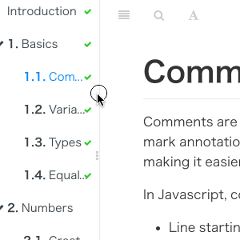

# 插件

<!-- @import "[TOC]" {cmd="toc" depthFrom=2 depthTo=3 orderedList=false} -->

<!-- code_chunk_output -->

- [使用](#使用)
- [默认插件](#默认插件)
- [第三方插件](#第三方插件)
  - [anchor-navigation-ex](#anchor-navigation-ex)
  - [page-toc-button](#page-toc-button)
  - [simple-page-toc](#simple-page-toc)
  - [atoc](#atoc)
  - [back-to-top-button](#back-to-top-button)
  - [chapter-fold](#chapter-fold)
  - [Expandable-chapters-small](#expandable-chapters-small)
  - [sectionx](#sectionx)
  - [splitter](#splitter)
  - [github](#github)
  - [github-buttons](#github-buttons)
  - [anchors](#anchors)
  - [ace](#ace)
  - [prism](#prism)
  - [theme-comscore](#theme-comscore)
  - [Emphasize](#emphasize)
  - [Alerts](#alerts)
  - [KaTex](#katex)
  - [include-codeblock](#include-codeblock)
  - [code](#code)
  - [Copy-code-button](#copy-code-button)
  - [Klipse](#klipse)
  - [insert-logo](#insert-logo)
  - [custom-favicon](#custom-favicon)
  - [popup](#popup)
  - [Mermaid-gb3](#mermaid-gb3)
  - [Puml](#puml)
  - [Graph](#graph)
  - [Chart](#chart)
  - [disqus](#disqus)
  - [search-pro](#search-pro)
  - [Search Plus](#search-plus)
  - [Sharing-plus](#sharing-plus)
  - [pageview-count](#pageview-count)
  - [ga](#ga)
  - [3-ba](#3-ba)
  - [donate](#donate)
  - [Local Video](#local-video)
  - [edit-link](#edit-link)
  - [hide-element](#hide-element)
  - [sidebar-style](#sidebar-style)
  - [tbfed-pagefooter](#tbfed-pagefooter)
  - [bibtex-citation](#bibtex-citation)
  - [bibtex](#bibtex)
  - [bibtex-indexed-cite](#bibtex-indexed-cite)
  - [change_girls](#change_girls)
  - [Advanced Emoji](#advanced-emoji)
  - [Sitemap-general](#sitemap-general)
  - [favicon](#favicon)
  - [Todo](#todo)
  - [Terminal](#terminal)
  - [Include-csv](#include-csv)
  - [Musicxml](#musicxml)
  - [Versions-select](#versions-select)
  - [rss](#rss)
  - [其他插件](#其他插件)
- [参考](#参考)

<!-- /code_chunk_output -->

<!-- [Toc] -->

## 使用

安装插件只须在书籍目录下修改 book.json 文件，在`book.json`写入相应插件`plugins`和配置`pluginsConfig`后，使用`gitbook install`安装插件。例如增长折叠目录的插件，须在 book.json 内增加下面代码:

```json
{
    "plugins": ["expandable-chapters-small"],
    "pluginsConfig": {
        "expandable-chapters-small":{}
    }
}
```

而后终端执行命令 `gitbook install` 来安装插件便可。如果使用该命令安装较慢，可使用npm安装：

```sh
npm install gitbook-plugin-plugin_name 
# 如插件：expandable-chapters-small
npm install gitbook-plugin-expandable-chapters-small
```

> 注意：安装位置在当前目录下的 node_modules 文件夹中。

## 默认插件

默认带有 5 个插件：

- highlight - 语法高亮插件
- search - 搜索插件，导航栏查询功能
- sharing - 分享插件，右上角分享功能
- font-settings - 字体设置插件（最上方的``"A"``符号）
- livereload - 热加载插件，为GitBook实时重新加载

去除默认插件，可以在插件名称前面加 `-`

## 第三方插件

插件地址：

- 官方获取插件地址： https://plugins.gitbook.com/（现在已经无法访问了）。
- 插件其他地址：https://www.npmjs.com/search?q=gitbook
- github：https://github.com/GitbookIO

记录一些实用的插件, 如果要指定插件的版本可以使用 `plugin@0.3.1`。下面的插件在 GitBook 的 `3.2.3` 版本中可以正常工作，因为一些插件可能不会随着 GitBook 版本的升级而升级，即下面的插件可能不适用高版本的 GitBook，所以这里指定了 GitBook 的版本。另外本文记录的插件在 Linux 下都是可以正确工作的，windows 系统没有测试。这里只是列举了一部分插件。

### anchor-navigation-ex
[插件源码]( https://github.com/zq99299/gitbook-plugin-anchor-navigation-ex)

添加Toc到侧边悬浮导航以及回到顶部按钮。导航扩展，增加锚点，返回顶部，显示序号。展示页面大纲的空间，可以按照段落来展示，可以快捷转挑到页面的相应位置。悬浮目录和回到顶部。需要注意以下两点：

- anchor-navigation-ex和别的插件会互相叠加影响，应选择其中一种即可

- 本插件只会提取 h\[1-3\] 标签作为悬浮导航

- 只有按照以下顺序嵌套才会被提取：必须要以 h1 开始，直接写 h2 不会被提取

  ```markdown
  # h1
  ### h2
  #### h3
  必须要以 h1 开始，直接写 h2 不会被提取
  ### h2
  ```

配置

```json
{
    "plugins": [
        "anchor-navigation-ex"
    ],
    "pluginsConfig": {
        "anchor-navigation-ex": {
            "showLevel": false,
            "showGoTop": true
        }
    }
}
```


### page-toc-button

maxTocDept 标题的最大深度（2 = h1 + h2 + h3），不支持值> 2，默认2；minTocSize 显示toc按钮的最小toc条目数。 默认 2

```json
"pluginsConfig": {
    "page-toc-button": {
        "maxTocDepth": 2,
        "minTocSize": 2
    }
}
```

### simple-page-toc
[插件源码](https://www.npmjs.com/package/gitbook-plugin-simple-page-toc) 

自动生成本页的目录结构。另外 GitBook 在处理重复的标题时有些问题，所以尽量不适用重复的标题。每个页面上添加了一个目录 (TOC)。您可以设置目录是否默认显示在所有页面上，您可以启用或禁用个别页面上的目录以覆盖默认值。

```json
{
    "plugins" : [
        "simple-page-toc"
    ],
    "pluginsConfig": {
        "simple-page-toc": {
            "maxDepth": 3,
            "skipFirstH1": true
        }
    }
}
```

使用方法: 在需要生成目录的地方加上 <\!-- toc -->

### atoc 
[插件源码](https://github.com/willin/gitbook-plugin-atoc)

在需要生成目录的地方加上 <\!-- toc -->，显示结果在右上角插入 TOC 目录

```json
"plugins": ["atoc", "splitter"],
"pluginsConfig": {
    "atoc": {
        "addClass": true,
        "className": "atoc"
    }
}
```

### back-to-top-button

回到顶部

```json
"plugins": [ "back-to-top-button" ],
```

### chapter-fold

导航目录（SUMMARY.md中的多级结构）折叠，gitbook默认目录没有折叠效果。其他几个相同插件的区别：
- chapter-fold 插件: 默认的侧边目录是全部展开的，该插件可以让文章按照层级目录折叠起来，同时只能展开一个目录。

- expandable-chapters 插件: 默认的侧边目录是全部展开的，该插件可以让文章按照层级目录折叠起来，展开后不会自动折叠。

- expandable-chapters-small 插件: 默认的侧边目录是全部展开的，该插件可以让文章按照层级目录折叠起来，展开后不会自动折叠，箭头相比 expandable-chapters 会细一些。

```json
"plugins": ["chapter-fold"],
```

### Expandable-chapters-small

使左侧的章节目录可以折叠

```json
"plugins": ["expandable-chapters-small"]
```

### sectionx
[插件源码](https://github.com/ymcatar/gitbook-plugin-sectionx)

将页面分块显示，标签的 tag 最好是使用 b 标签，如果使用 h1-h6 可能会和其他插件冲突。 分离各个段落，并提供一个展开收起的按钮

```json
{
    "plugins": [
       "sectionx"
   ],
    "pluginsConfig": {
        "sectionx": {
          "tag": "b"
        }
      }
}
```

使用示例

**Sectionx Demo**

Insert [markdown](http://gitbook.zhangjikai.com/GLOSSARY.html#markdown "Aaron Swartz 跟John Gruber共同设计的排版语言") content here (you should start with h3 if you use heading).

### splitter
[插件源码](https://github.com/yoshidax/gitbook-plugin-splitter)

在左侧目录和右侧内容之间添加一个可以拖拽的栏，用来调整两边的宽度。



```json
"plugins": [
    "splitter"
]
```

### github
[插件源码](https://github.com/GitbookIO/plugin-github)

在右上角显示 github 仓库的图标链接。

```json
"plugins": [
    "github"
],
"pluginsConfig": {
    "github": {
        "url": "https://github.com/zhangjikai"
    }
}
```

### github-buttons
[插件源码](https://github.com/azu/gitbook-plugin-github-buttons)

添加项目在 github 上的 star，watch，fork情况

```json
{
    "plugins": [
        "github-buttons"
    ],
    "pluginsConfig": {
        "github-buttons": {
            "repo": "zhangjikai/gitbook-use",
            "types": [
                "star",
                "watch",
                "fork"
            ],
            "size": "small"
        }
    }
}
```

### anchors
[插件源码](https://github.com/rlmv/gitbook-plugin-anchors)

添加 Github 风格的锚点样式


```json
"plugins" : [ "anchors" ]
```


### ace
[插件源码](https://github.com/ymcatar/gitbook-plugin-ace)

插入代码高亮编辑器，使 GitBook 支持ace 。默认情况下，line-height 为 1，会使代码显得比较挤，而作者好像没提供修改行高的选项，如果需要修改行高，可以到 `node_modules -> github-plugin-ace -> assets -> ace.js` 中加入下面两行代码 (30 行左右的位置)：

```css
editor.container.style.lineHeight = 1.25;
editor.renderer.updateFontSize();
```

不过上面的做法有个问题就是，每次使用 `gitbook install` 安装新的插件之后，代码又会重置为原来的样子。另外可以在 `website.css` 中加入下面的 css 代码来指定 ace 字体的大小

```css
.aceCode {
  font-size: 14px !important;
}
```

使用插件：

```json
"plugins": [
    "ace"
]
```

使用示例:

```json
// This is a hello world program for C.
#include <stdio.h>

int main(){
  printf("Hello World!");
  return 1;
}
```

### prism
[插件源码](https://github.com/gaearon/gitbook-plugin-prism)

基于 Prism 的代码高亮，使用 `Prism.js` 为语法添加高亮显示，需要将 `highlight` 插件去掉。该插件自带的主题样式较少，可以再安装 `prism-themes` 插件，里面多提供了几种样式，具体的样式可以参考 [这里](https://github.com/PrismJS/prism-themes)，在设置样式时要注意设置 css 文件名，而不是样式名。

```json
{
    "plugins": [
        "prism",
        "-highlight"
    ],
    "pluginsConfig": {
        "prism": {
            "css": [
                "prism-themes/themes/prism-base16-ateliersulphurpool.light.css"
            ]
        }
    }
}
```

如果需要修改背景色、字体大小等，可以在 `website.css` 定义 `pre[class*="language-"]` 类来修改，下面是一个示例：

```css
pre[class*="language-"] {
    border: none;
    background-color: #f7f7f7;
    font-size: 1em;
    line-height: 1.2em;
}
```
### theme-comscore
为标题添加颜色
```json
"plugins": [ "theme-comscore" ]
```

### Emphasize

为文字加上底色

```json
"plugins": [ "emphasize" ]
```

使用示例:
```markdown
This text is highlighted !
This text is highlighted with **[markdown](http://gitbook.zhangjikai.com/GLOSSARY.html#markdown "Aaron Swartz 跟John Gruber共同设计的排版语言")** !
This text is highlighted in green!
This text is highlighted in red!
This text is highlighted with a custom color!
```
效果
This text is highlighted !

This text is highlighted with **[markdown](http://gitbook.zhangjikai.com/GLOSSARY.html#markdown "Aaron Swartz 跟John Gruber共同设计的排版语言")** !

This text is highlighted in green!

This text is highlighted in red!

This text is highlighted with a custom color!

### Alerts

添加不同 alerts 样式的 blockquotes，目前包含 info, warning, danger 和 success 四种样式，可以根据配置针对不同的内容定义不同的颜色。

```json
{
    "plugins": ["alerts"]
}
```

下面是使用示例：

```markdown
Info styling
> **[info] For info**
>
> Use this for infomation messages.

Warning styling
> **[warning] For warning**
>
> Use this for warning messages.

Danger styling
> **[danger] For danger**
>
> Use this for danger messages.

Success styling
> **[success] For info**
>
> Use this for success messages.
```

效果如下所示：

Info styling

> **For info**
>
> Use this for infomation messages.

Warning styling

> **For warning**
>
> Use this for warning messages.

Danger styling

> **For danger**
>
> Use this for danger messages.

Success styling

> **For info**
>
> Use this for success messages.

### KaTex
[插件源码](https://github.com/GitbookIO/plugin-katex)

为了支持数学公式, 我们可以使用`KaTex`和`MathJax`插件, 官网上说`Katex`速度要快于`MathJax`

[MathJax使用LaTeX语法编写数学公式教程](http://iori.sinaapp.com/17.html)

```json
"plugins": [
    "katex"
]
```

使用示例:
```latex
When $$a \ne 0$$ there are two solutions to $$ax^2 + bx + c = 0$$ 
and they are $$x= {-b \pm \sqrt{b^2-4ac} \over 2a}$$.

$$\int_{-\infty}^{\infty } g(x) dx$$

$$ 1 \over 3$$
```
效果：

When $$a \ne 0$$ there are two solutions to $$ax^2 + bx + c = 0$$ and they are $$x= {-b \pm \sqrt{b^2-4ac} \over 2a}$$.

$$\int_{-\infty}^{\infty } g(x) dx$$

$$ 1 \over 3$$


### include-codeblock
[插件源码](https://github.com/azu/gitbook-plugin-include-codeblock)

使用代码块的格式显示所包含文件的内容. 该文件必须存在。插件提供了一些配置，可以区插件官网查看。如果同时使用 ace 和本插件，本插件要在 ace 插件前面加载。

```json
{
    "plugins": [
        "include-codeblock"
    ],
    "pluginsConfig": {
        "include-codeblock": {
            "template": "ace",
            "unindent": true,
            "edit": false,
            "theme": "monokai"
        }
    }
}
```

使用示例：

```css
/* CSS for website */
h1 , h2{
    border-bottom: 1px solid #EFEAEA;
    padding-bottom: 3px;
}
.markdown-section>:first-child {
    margin-top: 0!important;
}
.page-wrapper {
    margin-top: -1.275em;
}
.book .book-body .page-wrapper .page-inner section.normal {
    min-height:350px;
    margin-bottom: 30px;
}

.book .book-body .page-wrapper .page-inner section.normal hr {
    height: 0px;
    padding: 0;
    margin: 1.7em 0;
    overflow: hidden;
    background-color: #e7e7e7;
    border-bottom: 1px dotted #e7e7e7;
}

.video-js {
    width:100%;
    height: 100%;
}

pre[class*="language-"] {
    border: none;
    background-color: #f7f7f7;
    font-size: 1em;
    line-height: 1.2em;
}

.book .book-body .page-wrapper .page-inner section.normal {
    font-size: 16px;
    font-family:  "ubuntu", "Tahoma", "Microsoft YaHei", arial, sans-serif;
}

.aceCode {
  font-size: 14px !important;
}

input[type=checkbox]{
    margin-left: -2em;
}

.page-footer span{
    font-size: 12px;
}

.page-footer .copyright {
    float: left;
}

.body, html {
    overflow-y: hidden;
}

.versions-select select {
    height: 2em;
    line-height: 2em;
    border-radius: 4px;
    background: #efefef;
}
```

### code

复制代码

```json
{
    "plugins" : [ "code" ]
}
```

### Copy-code-button

为代码块添加复制的按钮。

```json
{
    "plugins": ["copy-code-button"]
}
```

效果如下图所示：


### Klipse

集成 Klipse (online code evaluator)。[Klipse](https://github.com/viebel/klipse)

```json
{
    "plugins": ["klipse"]
}
```

klipse 目前支持下面的语言：

-   javascript: evaluation is done with the javascript function eval and pretty printing of the result is done with pretty-format
-   clojure\[script\]: evaluation is done with Self-Hosted Clojurescript
-   ruby: evaluation is done with Opal
-   C++: evaluation is done with JSCPP
-   python: evaluation is done with Skulpt
-   scheme: evaluation is done with BiwasScheme
-   PHP: evaluation is done with Uniter
-   BrainFuck
-   JSX
-   EcmaScript2017
-   Google Charts: See Interactive Business Report with Google Charts.

下面是一个使用示例：

````markdown
```eval-python
print [x + 1 for x in range(10)]
```
````

效果如下所示：


### insert-logo

在左上角插入一个logo图片的插件，就像上面截图中的一样，可以插入自己的logo图片   

```json
"plugins": [ "insert-logo" ],
"pluginsConfig": {
    "insert-logo": {
        "url": "https://fangjian98.gitee.io/gitbook/images/android.png", // 网络图片
        "url": "images/logo.png",  // 本地图片
        "style": "background: none; max-height: 30px; min-height: 30px"
    }
}
```

### custom-favicon

修改标题栏图标：设置浏览器选项卡标题栏的小图标，注意只支持ico后缀的图片，并且只支持本地图片，不支持网络图片链接。图标的分辨率要是32x32的。

```json
"plugins" : ["custom-favicon"],
"pluginsConfig" : {
    "favicon": "icon/favicon.ico"
}
```

### popup

弹出大图：点击可以在新窗口展示图片

```json
"plugins": [ "popup" ],
```

### Mermaid-gb3

支持渲染[Mermaid](https://github.com/knsv/mermaid)图表  

```json
"plugins": [
    "mermaid-gb3"
]
```

使用示例:


### Puml

使用 PlantUML 展示 uml 图。[PlantUML 地址](http://plantuml.com/)

```json
{
    "plugins": ["puml"]
}
```

使用示例：

```css

Class Stage
    Class Timeout {
        +constructor:function(cfg)
        +timeout:function(ctx)
        +overdue:function(ctx)
        +stage: Stage
    }
    Stage <|-- Timeout

```

效果如下所示：


### Graph

使用 function-plot 绘制数学函数图。[function-plot](https://mauriciopoppe.github.io/function-plot/)

```json
{
    "plugins": [ "graph" ],
}
```

下面是一个示例，需要注意的是 `` 块中的内容必须是合法的 JSON 格式。

```css

{
    "title": "1/x * cos(1/x)",
    "grid": true,
    "xAxis": {
        "domain": [0.01, 1]
    },
    "yAxis": {
        "domain": [-100, 100]
    },
    "data": [{
        "fn": "1/x * cos(1/x)",
        "closed": true
    }]
}

```

效果如下所示：


### Chart

使用 C3.js 或者 Highcharts 绘制图形。[C3.js](https://github.com/c3js/c3)  [highcharts](https://github.com/highcharts/highcharts)

```json
{
    "plugins": [ "chart" ],
    "pluginsConfig": {
        "chart": {
            "type": "c3"
        }
    }
}
```

type 可以是 `c3` 或者 `highcharts`, 默认是 `c3`.

下面是一个示例：

```css

{
    "data": {
        "type": "bar",
        "columns": [
            ["data1", 30, 200, 100, 400, 150, 250],
            ["data2", 50, 20, 10, 40, 15, 25]
        ],
        "axes": {
            "data2": "y2"
        }
    },
    "axis": {
        "y2": {
            "show": true
        }
    }
}

```

效果如下所示：


### disqus
[插件源码](https://github.com/GitbookIO/plugin-disqus)

添加disqus评论，需要注册disqus.com账号，[使用例程](https://blog.csdn.net/weixin_38171180/article/details/100689129;)

```json
"plugins": [
    "disqus"
],
"pluginsConfig": {
    "disqus": {
        "shortName": "gitbookuse"
    }
}
```

### search-pro

高级搜索：支持中英文，准确率更高一些

```json
"plugins": [
    "-lunr", 
    "-search", 
    "search-pro"
]
```

### Search Plus

支持中文搜索, 需要将默认的 `search` 和 `lunr` 插件去掉。

```json
{
    "plugins": ["-lunr", "-search", "search-plus"]
}
```

### Sharing-plus

分享当前页面，比默认的 sharing 插件多了一些分享方式，默认只有Facebook、Google+、Twiter、Weibo、Instapaper，插件可以有更多分享方式，也可以关闭指定分享方式。

```json
{
    "plugins": ["-sharing", "sharing-plus"]
"pluginsConfig": {
    "sharing": {
       "douban": false,
       "facebook": false,
       "google": true,
       "hatenaBookmark": false,
       "instapaper": false,
       "line": true,
       "linkedin": true,
       "messenger": false,
       "pocket": false,
       "qq": false,
       "qzone": true,
       "stumbleupon": false,
       "twitter": false,
       "viber": false,
       "vk": false,
       "weibo": true,
       "whatsapp": false,
       "all": [
           "facebook", "google", "twitter",
           "weibo", "instapaper", "linkedin",
           "pocket", "stumbleupon"
       ]
   }
}
}
```

### pageview-count

阅读量计数：记录每个文章页面被访问的次数

```json
 "plugins": [ "pageview-count"]
```

### ga
[插件源码](https://github.com/GitbookIO/plugin-ga)

Google 统计  

```json
"plugins": [
    "ga"
 ],
"pluginsConfig": {
    "ga": {
        "token": "UA-XXXX-Y"
    }
}
```

### 3-ba

百度统计  

```json
{
    "plugins": ["3-ba"],
    "pluginsConfig": {
        "3-ba": {
            "token": "xxxxxxxx"
        }
    }
}
```

### donate
[插件源码](https://github.com/willin/gitbook-plugin-donate)

打赏插件  

```json
"plugins": [
    "donate"
],
"pluginsConfig": {
    "donate": {
        "wechat": "https://zhangjikai.com/resource/weixin.png",
        "alipay": "https://zhangjikai.com/resource/alipay.png",
        "title": "",
        "button": "赏",
        "alipayText": "支付宝打赏",
        "wechatText": "微信打赏"
    }
}
```

### Local Video

使用Video.js 播放本地视频  

```json
"plugins": [ "local-video" ]
```

使用示例：为了使视频可以自适应，我们指定视频的`width`为100%，并设置宽高比为`16:9`，如下面所示

```css

<video id="my-video" class="video-js" controls preload="auto" width="100%"
poster="https://zhangjikai.com/resource/poster.jpg" data-setup='{"aspectRatio":"16:9"}'>
  <source src="https://zhangjikai.com/resource/demo.mp4" type='video/mp4' >
  <p class="vjs-no-js">
    To view this video please enable JavaScript, and consider upgrading to a web browser that
    <a href="http://videojs.com/html5-video-support/" target="_blank">supports HTML5 video</a>
  </p>
</video>

```

另外我们还要再配置下css，即在website.css中加入

```css
.video-js {
    width:100%;
    height: 100%;
}
```

To view this video please enable JavaScript, and consider upgrading to a web browser that [supports HTML5 video](https://videojs.com/html5-video-support/)


### edit-link
[插件源码](https://github.com/zhaoda/gitbook-plugin-editlink)

如果将 GitBook 的源文件保存到github或者其他的仓库上，使用该插件可以链接到当前页的源文件上。  

```json
"plugins": ["edit-link"],
"pluginsConfig": {
    "edit-link": {
        "base": "https://github.com/USER/REPO/edit/BRANCH",
        "label": "Edit This Page"
    }
}
```

### hide-element

隐藏元素：默认的gitbook左侧提示：Published with GitBook

```json
"plugins": [ "hide-element" ],
"pluginsConfig": {
    "hide-element": {
        "elements": [".gitbook-link"]
    }
}
```

### sidebar-style

导航栏显示作者信息

```json
"plugins": ["sidebar-style"],
"pluginsConfig": {
    "sidebar-style": {
        "title": "前端开发",
        "author": "mealoore"
    }
}
```

### tbfed-pagefooter
[插件源码](https://github.com/zhj3618/gitbook-plugin-tbfed-pagefooter)

自定义页脚，显示版权和最后修订时间。

```json
"plugins": [
   "tbfed-pagefooter"
],
"pluginsConfig": {
    "tbfed-pagefooter": {
        "copyright":"Copyright &copy zhangjikai.com 2017",
        "modify_label": "该文件修订时间：",
        "modify_format": "YYYY-MM-DD HH:mm:ss"
    }
}
```

### bibtex-citation
[插件源码](https://github.com/manuelmitasch/gitbook-plugin-bibtex-citation)
插件需要一个literature.bib文件在你的根文件夹，可以使用文件中定义的bibtex键值引用文献。插件目前只支持IEEE引用样式。（该插件有bug，直接使用会报找不到引用文献的错，按照[此处](https://github.com/manuelmitasch/gitbook-plugin-bibtex-citation/pull/5/files/c43f0f34bb1f706fc4097934d0e70c973aa0f9a4)修改后，无法跳转）
```markdown
{{ "some-key" | cite }}
```
您还可以通过添加参考表，一般是在文章末尾
```markdown
 
```
配置
```json
{
    "plugins": ["bibtex-citation"]
}
```

### bibtex
[插件源码](https://github.com/leandrocostasouza/gitbook-plugin-bibtex)
使用方法和插件`bibtex-citation`一样，暂时没有发现bug
```json
{
    "plugins": [
        "bibtex"
    ],
    "pluginsConfig": {
      "bibtex": {
        "bibliography": "literature.bib"
      }
    }
}
```

### bibtex-indexed-cite
[插件源码](https://github.com/WorldAfterCapital/gitbook-plugin-bibtex-cite)
GitBook项目创建时间不长，有些功能可能还没有插件，或者有些插件的功能并不完善，比如参考文献的插件。GitBook有多个使用bibtex生成参考文献的格式，多数很少更新，且功能过于简单。使用方法和插件`bibtex-citation`一样，会显示所有参考文献（包括没有使用的）
```json
"plugins": ["bibtex-indexed-cite"],
// 1.2版本后需要该配置
"pluginsConfig": {
"bibtex-indexed-cite": {
        "path": "/"
    }
}
```
其中path用来指定参考文献库“literature.bib”所在的路径。在项目根目录，新增literature.bib和References.md两个文件，其中literature.bib用来存放参考文献数据，References.md文件中写入如下内容：
```css
 
```
在需要引用参考文献的地方使用如下命令：`{{"TLW"|cite}}`，效果为{{"TLW"|cite}}
> 注意：
> 1. 引用名中不能有中文,如\{\{"XingWL23"|cite}}不能为\{\{"中文名称-23"|cite}}；
> 
> 2. 参考文献需要单独用一个文件生成，文件名为“References.md”。

bibtex-indexed-cite插件，目前只支持IEEE的引文格式，且引用没有上标，可通过自定义样式表实现上标效果：
```css
a[href*="#cite"] {
    vertical-align: super;
    font-size: 0.8em;
}
```
### change_girls

 可自动切换的背景

```json
"plugins":["change_girls"],
"pluginsConfig": {
    "change_girls" : {
        "time" : 5,
        "urls" : [
            "girlUrl1", "girlUrl2",...
        ]
    }
}
```

### Advanced Emoji

支持emoji表情，[emoij表情列表](http://www.emoji-cheat-sheet.com/)  

```json
"plugins": [
    "advanced-emoji"
]
```

使用示例：

     

### Sitemap-general

生成sitemap  

```json
{
    "plugins": ["sitemap-general"],
    "pluginsConfig": {
        "sitemap-general": {
            "prefix": "http://gitbook.zhangjikai.com"
        }
    }
}
```

### favicon
[插件源码](https://github.com/menduo/gitbook-plugin-favicon)

更改网站的 favicon.ico，为网站添加了favicon和Apple Touch图标。

```json
{
    "plugins": [
        "favicon"
    ],
    "pluginsConfig": {
        "favicon": {
            "shortcut": "assets/images/favicon.ico",
            "bookmark": "assets/images/favicon.ico",
            "appleTouch": "assets/images/apple-touch-icon.png",
            "appleTouchMore": {
                "120x120": "assets/images/apple-touch-icon-120x120.png",
                "180x180": "assets/images/apple-touch-icon-180x180.png"
            }
        }
    }
}
```

### Todo

添加 Todo 功能。默认的 checkbox 会向右偏移 2em，如果不希望偏移，可以在 `website.css` 里加上下面的代码:

```css
input[type=checkbox]{
    margin-left: -2em;
}
```

配置

```
"plugins": ["todo"]
```

使用示例：

- [ ] write some articles
- [x] drink a cup of tea

### Terminal

模拟终端显示，主要用于显示命令以及多行输出，不过写起来有些麻烦。

```json
{
    "plugins": [
        "terminal"
    ],
    "pluginsConfig": {
        "terminal": {
            "copyButtons": true,
            "fade": false,
            "style": "flat"
        }
    }
}
```

现在支持 6 种标签：

-   command: Command "executed" in the terminal.
-   delimiter: Sequence of characters between the prompt and the command.
-   error: Error message.
-   path: Directory path shown in the prompt.
-   prompt: Prompt of the user.
-   warning: Warning message.

标签的使用格式如下所示：

```
**[<tag_name> 内容]
```

为了使标签正常工作，需要在代码块的第一行加入 `**[termial]` 标记，下面是一个完整的示例：

<pre>```
**[terminal]
**[prompt foo@joe]**[path ~]**[delimiter  $ ]**[command ./myscript]
Normal output line. Nothing special here...
But...
You can add some colors. What about a warning message?
**[warning [WARNING] The color depends on the theme. Could look normal too]
What about an error message?
**[error [ERROR] This is not the error you are looking for]
```</pre>

效果如下所示：

```
**[terminal]
**[prompt foo@joe]**[path ~]**[delimiter  $ ]**[command ./myscript]
Normal output line. Nothing special here...
But...
You can add some colors. What about a warning message?
**[warning WARNING The color depends on the theme. Could look normal too]
What about an error message?
**[error ERROR This is not the error you are looking for]
```

terminal 支持下面 5 种样式，如果需要更换样式，在 pluginsConfig 里配置即可。

-   black: Just that good old black terminal everybody loves.
-   classic: Looking for green color font over a black background? This is for you.
-   flat: Oh, flat colors. I love flat colors. Everything looks modern with them.
-   ubuntu: Admit it or not, but Ubuntu have a good looking terminal.
-   white: Make your terminal to blend in with your GitBook.

> 注意：该插件和 `code` 插件冲突，导致warning等颜色无法正常解析。
### Include-csv

展示 csv 文件。

```json
{
    "plugins": ["include-csv"]
}
```

使用示例：

```css
 
```

效果如下所示：

[./assets/csv/test.csv](http://gitbook.zhangjikai.com/assets/csv/test.csv)

| 产业     | 数值 | 比重   |
| -------- | ---- | ------ |
| 第一产业 | 111  | 10.00% |
| 第二产业 | 222  | 20.00% |
| 第三产业 | 333  | 30.00% |
| 第四产业 | 444  | 40.00% |

### Musicxml

支持 musicxml 格式的乐谱渲染。[musicXML](http://www.musicxml.com/)

```json
{
    "plugins": ["musicxml"]
}
```

下面是一个示例，需要注意的是 block 中的内容必须是一个合法的 musicxml 文件路径，并且不能有换行和空格。

```css
assets/musicxml/mandoline - debussy.xml
```

效果如下所示


### Versions-select

添加版本选择的下拉菜单，针对文档有多个版本的情况。

```json
{
    "plugins": [ "versions-select" ],
    "pluginsConfig": {
        "versions": {
            "options": [
                {
                    "value": "http://gitbook.zhangjikai.com",
                    "text": "v3.2.2"
                },
                {
                    "value": "http://gitbook.zhangjikai.com/v2/",
                    "text": "v2.6.4"
                }
            ]
        }
    }
}
```

我们可以自定义 css 来修改 select 的显示样式：

```css
.versions-select select {
    height: 2em;
    line-height: 2em;
    border-radius: 4px;
    background: #efefef;
}
```

效果见左上角。

### rss

添加 rss 订阅功能。

```json
{
    "plugins": [ "rss" ],
    "pluginsConfig": {
        "rss": {
            "title": "GitBook 使用教程",
            "description": "记录 GitBook 的配置和一些插件的使用",
            "author": "Jikai Zhang",
            "feed_url": "http://gitbook.zhangjikai.com/rss",
            "site_url": "http://gitbook.zhangjikai.com/",
            "managingEditor": "me@zhangjikai.com",
            "webMaster": "me@zhangjikai.com",
            "categories": [
                "gitbook"
            ]
        }
    }
}
```

效果见右上角。

### 其他插件

- [anchor-navigation](https://github.com/yaneryou/gitbook-plugin-anchor-navigation)：锚点导航
- [ad](https://github.com/zhaoda/gitbook-plugin-ad)：在每个页面顶部和底部添加广告或任何自定义内容。
- [book-summary-scroll-position-saver](https://github.com/yoshidax/gitbook-plugin-book-summary-scroll-position-saver)：自动保存左侧目录区域导航条的位置。
- [expandable-chapters](https://github.com/DomainDrivenArchitecture/gitbook-plugin-expandable-chapters)：收起或展开章节目录中的父节点。
- [page-treeview](https://www.npmjs.com/package/gitbook-plugin-page-treeview-simple) ：插件是生成页内目录
- page-treeview-simple：和 `page-treeview` 功能相同，在其基础之上修改了以下内容——去除 `copyRight` 的提示内容与占用的空白高和取消章节的折叠效果，默认展开显示完整章节
- [page-toc](https://www.npmjs.com/package/gitbook-plugin-page-toc-af)：每个页面上添加了一个目录 (TOC)。您可以设置目录是否默认显示在所有页面上，您可以启用或禁用个别页面上的目录以覆盖默认值。
- summary：目录自动生成
- ancre-navigation：右上角悬浮导航和回到顶部按钮
- intopic-toc：在右侧插入目录，文中不需要写 Toc
- page-toc-button：悬浮目录
- page-treeview：
- flexible-alerts：警报

**可能有用的**

- [redirect](https://github.com/ketan/gitbook-plugin-redirect)：页面跳转(重定向)。
- [image-captions](https://github.com/todvora/gitbook-plugin-image-captions)：抓取内容中图片的 `alt` 或 `title` 属性，在图片下面显示标题。
- [mermaid](https://github.com/JozoVilcek/gitbook-plugin-mermaid)：使用流程图（没有安装成功）。
- [latex-codecogs](https://github.com/GitbookIO/plugin-latex-codecogs)：使用数学方程式。
- [sitemap](https://github.com/GitbookIO/plugin-sitemap)：生成站点地图。
- [baidu](https://github.com/poppinlp/gitbook-plugin-baidu)：使用百度统计。
- [duoshuo](https://github.com/codepiano/gitbook-plugin-duoshuo)：使用多说评论。
- exercises：在文档中增加交互练习内容，目前只支持js语言。
- quiz：在文档中增加测验内容，支持单选、多选、排序。
- localized-footer：为GitBook的每个页面添加页脚内容。
- changyan：为GitBook页面添加畅言评论框。
- iframely：在页面中嵌入常见视频网站内容。


**一般用不到的**

- [youtubex](https://github.com/ymcatar/gitbook-plugin-youtubex)：插入 YouTube 视频。
- [fbqx](https://github.com/Erwin-Chan/gitbook-plugin-fbqx)：使用填空题。
- [mcqx](https://github.com/ymcatar/gitbook-plugin-mcqx)：使用选择题，交互式多选
- [spoiler](https://github.com/ymcatar/gitbook-plugin-spoiler)：隐藏答案，当鼠标划过时才显示。
- [styles-sass](https://github.com/GitbookIO/plugin-styles-sass)：使用 SASS 替换 CSS。
- [styles-less](https://github.com/GitbookIO/plugin-styles-less)：使用 LESS 替换 CSS。

**常见插件配置**

```json
{
  "plugins": [
    "edit-link",
    "hide-element",
    "chapter-fold",
    "expandable-chapters-small",
    "code",
    "splitter",
    "-lunr",
    "-search",
    "-sharing",
    "search-pro",
    "pageview-count",
    "tbfed-pagefooter",
    "popup",
    "sidebar-style",
    "klipse",
    "anchor-navigation-ex"
  ],
  "pluginsConfig": {
    "edit-link": {
      "base": "https://github.com/Mealoore/gitbook_guide",
      "label": "Edit This Page"
    },
    "hide-element": {
      "elements": [
        ".gitbook-link"
      ]
    },
    "expandable-chapters-small": {},
    "tbfed-pagefooter": {
      "copyright": "Copyright &copy dsx2016.com 2019",
      "modify_label": "该文章修订时间：",
      "modify_format": "YYYY-MM-DD HH:mm:ss"
    },
    "sharing": {
      "douban": true,
      "facebook": true,
      "google": true,
      "pocket": true,
      "qq": true,
      "qzone": true,
      "twitter": true,
      "weibo": true,
      "all": [
        "douban",
        "facebook",
        "google",
        "instapaper",
        "linkedin",
        "twitter",
        "weibo",
        "messenger",
        "qq",
        "qzone",
        "viber",
        "whatsapp"
      ]
    },
    "sidebar-style": {
      "title": "前端开发",
      "author": "mealoore"
    },
    "anchor-navigation-ex": {
      "tocLevel1Icon": "fa fa-hand-o-right",
      "tocLevel2Icon": "fa fa-hand-o-right",
      "tocLevel3Icon": "fa fa-hand-o-right",
      "multipleH1": false,
      "multipleH2": false,
      "multipleH3": false,
      "multipleH4": false,
      "showLevelIcon": false,
    }
  }
}
```

[配置模板](https://github.com/Mealoore/gitbook_guide/template.json)

> 注意：配置文件中不能有注释，也不能有多余的逗号，否则会报错。json在发明之初就是不提倡注释的。

## 参考

1. [gitook 插件 文章目录导航 ](https://blog.51cto.com/ghostwritten/5357717)
2. [gitbook 插件 文章 TOC 目录](https://blog.csdn.net/xixihahalelehehe/article/details/125117549)
2. [关于gitbook的结构及优化配置](https://blog.csdn.net/weixin_44008788/article/details/113920083)
2. [官方文档 - 使用GitBook和Typora生成类似官方文档](https://www.cnblogs.com/h-z-y/p/14437348.html)：该博客给出了很多插件的源码地址
2. http://gitbook.zhangjikai.com/


 